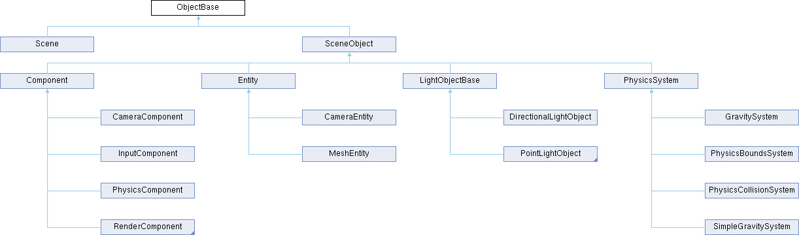
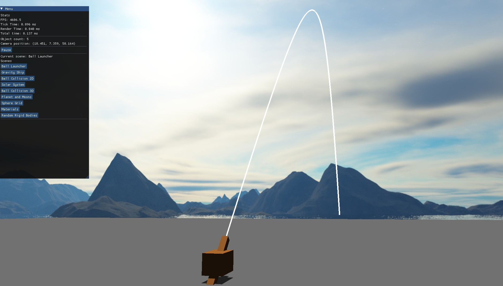
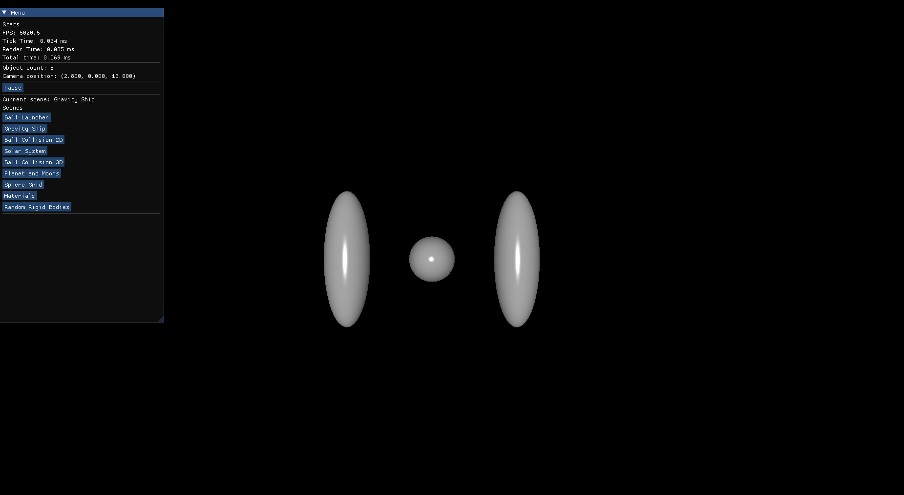
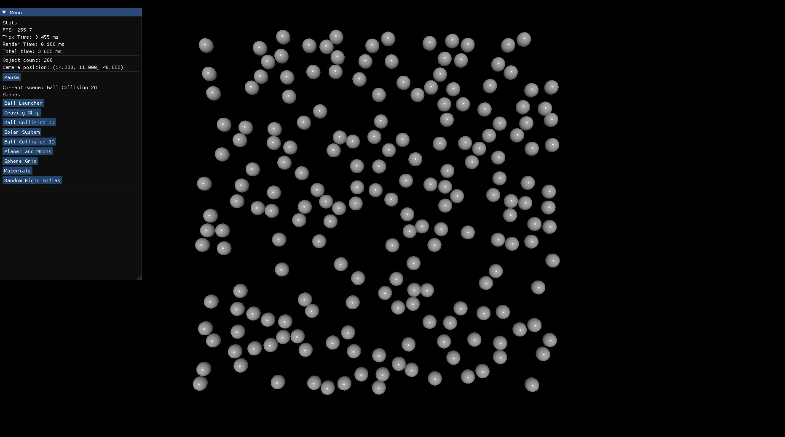
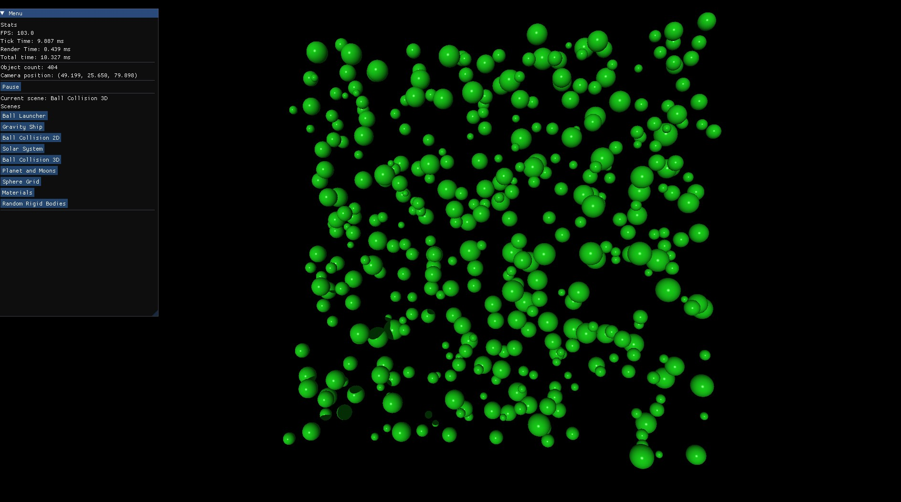
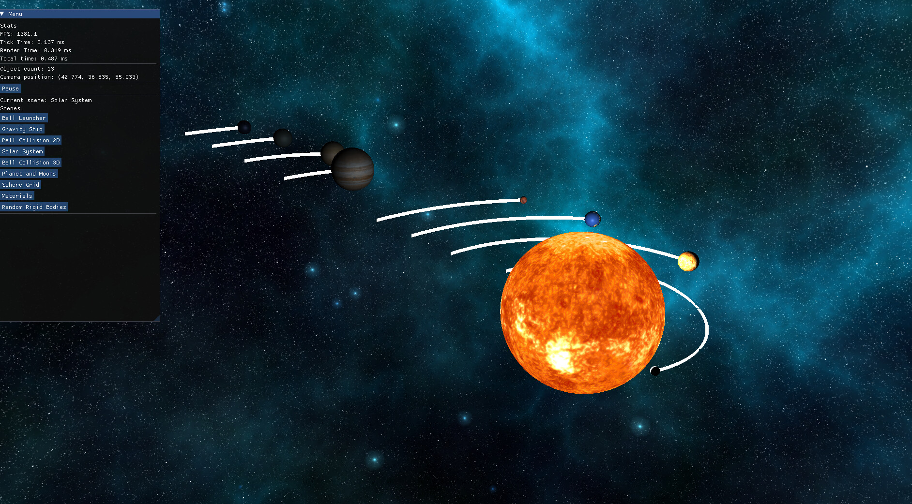
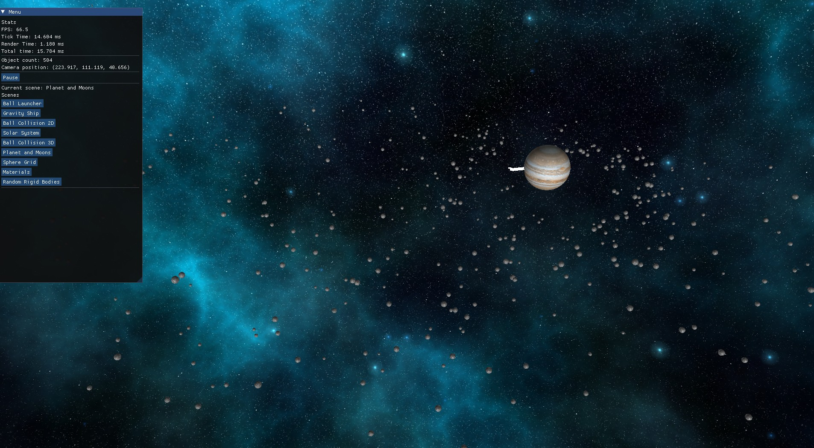
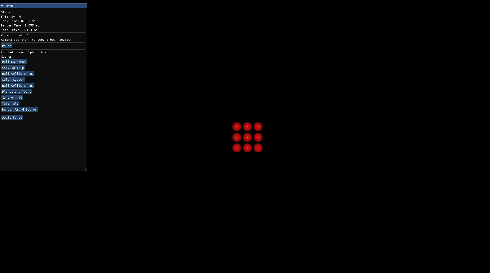
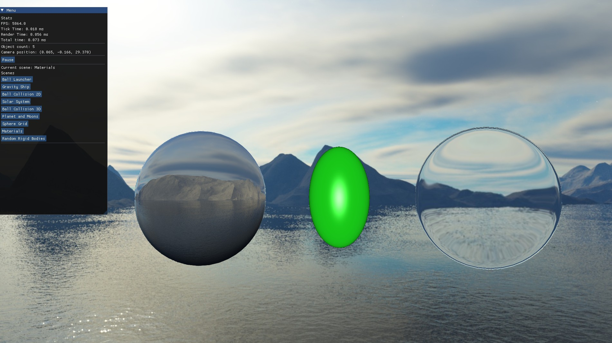
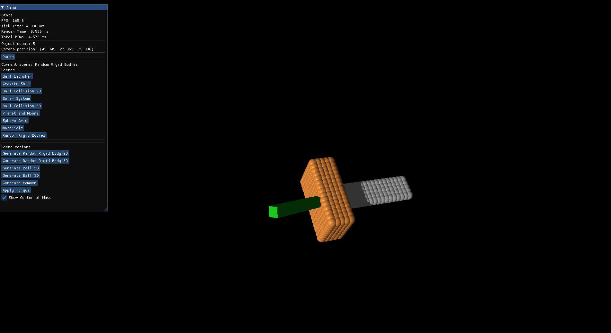

# Sim Engine

Sim Engine is an engine designed for graphical and physical simulations.  
Rendering is currently based on OpenGL, while the physics system is implemented entirely from scratch, without using external solutions such as PhysX.  
The engine currently includes several sandbox scenes that demonstrate its current capabilities.  
It is being developed as a long-term project, with the goal of adding increasingly advanced physics and graphics, as well as testing different approaches and seeing how they work together.

## Table of Contents

1. [Engine Architecture](#1-engine-architecture)  
   - [Core](#core)  
   - [Managers](#managers)  
   - [Rendering](#rendering)  
   - [Physics](#physics)  
   - [Scene](#scene)  
   - [Scene Manager](#scene-manager)
   - [Example Scene Setup](#example-scene-setup)
2. [Description of Sample Scenes](#2-description-of-sample-scenes)  
   - [Ball Launcher](#ball-launcher)  
   - [Gravity Ship](#gravity-ship)  
   - [Ball Collision 2D/3D](#ball-collision-2d3d)  
   - [Solar System](#solar-system)  
   - [Planet and Moons](#planet-and-moons)  
   - [Sphere Grid](#sphere-grid)  
   - [Materials](#materials)  
   - [Random Rigid Bodies](#random-rigid-bodies)  
3. [Third Party Libraries](#3-third-party-libraries)   

---

## 1. Engine Architecture

### Core

Engine core includes basic classes for creating objects on a scene and adding components to them. The engine uses ECS that is based on Unreal Engine. Each entity can have both components and child entities.  
The main object for the scene is `SceneObject`, which is the basic object that can be placed on the scene. Entities and different systems, such as physics systems, inherit from it. The system in the engine resembles `WorldSubsystem` from Unreal Engine.


*Class hierarchy derived from ObjectBase*

### Managers

Asset managers are responsible for loading and unloading assets such as textures, models, and materials. Each asset is loaded on demand and unloaded when no objects hold a reference to it.

### Rendering

The rendering section includes the basic abstract classes and their concrete OpenGL implementations. Currently, OpenGL is the only backend, but the system has been designed to allow additional implementations to be added in the future if necessary. The basic classes include `Line`, `Mesh`, `Shader`, `Texture`, `Skybox`, and `ShadowMap`.

### Physics

Physics is currently based on a set of systems that apply forces to objects or modify their velocity. To make this possible, each object participating in the physics simulation must have a `PhysicsComponent`, which is responsible for calculating velocity and acceleration based on applied forces or momenta. Thanks to this design, it is possible to create separate scenes with independent physics systems that do not interfere with one another.

Currently, the physics module includes several systems:

- **Gravity System** – calculates gravitational forces between objects in the scene (used in the “Planet and Moons” and “Solar System” scenes).  
- **Simple Gravity System** – simplified gravity with a constant acceleration of 9.81 m/s², used for objects placed on the surface of a planet.  
- **Physics Bounds System** – keeps objects within the scene boundaries (used in 2D/3D ball simulations).  
- **Physics Collision System** – calculates ball velocities after collisions.  

### Scene

It includes the basic components required for scene building, such as:

- Camera  
- Lights: DirectionalLight, PointLight, SpotLight  
- Basic physics systems  
- Scene loading manager  

### Scene Manager

`Scene Manager` is a static class that allows new scenes to be registered and later loaded by name. The ImGui panel retrieves all available scene names and displays them as buttons.  
Thanks to the asset managers, all assets from the previous scene are unloaded and new scene's assets are loaded.

### Example Scene Setup

Here is a simple example of how to set up a scene using Sim Engine:

```cpp
auto camera = AddObject<CameraEntity>("Camera");
auto cameraComp = camera->GetCameraComponent();
cameraComp->SetAsActiveCamera();
cameraComp->SetPosition({32.0f, 26.0f, 69.0f});

AddObject<PhysicsCollisionSystem>();
auto boundsSystem = AddObject<PhysicsBoundsSystem>();

auto light = AddObject<DirectionalLightObject>("Directional Light");
light->SetDirection({0.1f, 0.1f, -60.0f});
light->lightData.ambient = 1.0f;

auto ball = AddObject<MeshEntity>();
auto phys = ball->AddComponent<PhysicsComponent>();

ball->SetMesh(MeshManager::Get().GetAssetByName("sphere"));
ball->SetMaterial(MaterialManager::Get().GetAssetByName("emerald"));
```
---

## 2. Description of Sample Scenes

### Ball Launcher

It simulates shooting projectiles from a small vehicle equipped with a rotating barrel. The vehicle can be moved using the keyboard, and the barrel's angle can also be adjusted with keyboard input.  
The scene includes a skybox, a plane as a ground, and a projectile trajectory visualized as a white line that accounts for both gravitational acceleration and air resistance (linear damping).  
After firing a projectile, the vehicle recoils. Projectiles stop after hitting the ground.



### Gravity Ship

It demonstrates the influence of gravitational forces between objects. The central object remains still at the beginning, but once the left and right objects start moving, the center one follows them.  
This scene illustrates a phenomenon similar to the one responsible for the rigidity of physical bodies.



### Ball Collision 2D/3D

It simulates ball collisions in both 2D and 3D. 2D only blocks camera rotation and does not use an orthographic projection. The 2D simulation was created to visualize ball collisions. Balls are enclosed in a box so they cannot escape the scene.




### Solar System

This is a simple planetary system. For better visualization, the masses, distances, and velocities have been simplified.  
One planet has a larger mass and a lower velocity, which destabilizes the orbits of the other planets.  
Objects bounce off each other upon collision.



### Planet and Moons

A large and massive planet at the center attracts smaller objects, which form a rotating ring.  
The entire system moves together, bound by gravitational forces.



### Sphere Grid

This shows a rigid body composed of a 3x3 grid of balls.  
Torque can be applied to the object, resulting in both linear and angular velocity, which are subsequently damped.



### Materials

The scene shows a few basic materials:

- Light-refracting material  
- Light-reflecting material  
- The engine's basic material



### Random Rigid Bodies

The scene best shows the translational and rotational motion of a rigid body.  
It is possible to generate various 2D and 3D objects, as well as a hammer.  
The center of the green cuboid corresponds to the object's center of mass.  
Rotations of the body are calculated using quaternions, in accordance with the physical model of rigid body rotation.



---

## 3. Third Party Libraries

- GLEW  
- GLFW  
- GLM  
- spdlog  
- stb_image  
- TinyObjLoader  
- ImGui
